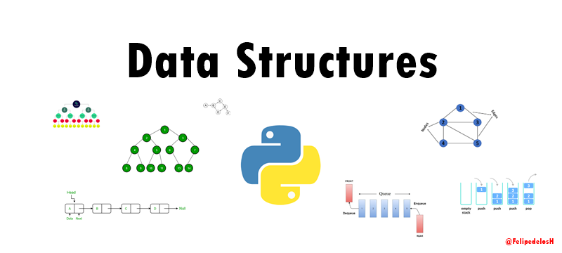

<h1 align="center"> FelipedelosH </h1>
 
<h4>Python Data Structures</h4>

 
:construction: Status of project :construction:
  
Welcome to my GitHub repository dedicated to implementing data structures and algorithms in Python! 🎉

In this repository, you'll find a comprehensive collection of fundamental and advanced data structures, along with their associated algorithms. Each implementation is designed to be clear, concise, and educational, making it a valuable resource for both beginners and experienced developers.

## :hammer:Funtions:

- `Function 1`: Singly Linked List 
- `Function 2`: Doubly Linked List 
- `Function 3`: Neque porro quisquam est qui dolorem ipsum quia dolor sit amet. 
- `Function 3a`: Neque porro quisquam est qui dolorem ipsum quia dolor sit amet. 
- `Function 4`: Neque porro quisquam est qui dolorem ipsum quia dolor sit amet. 

## :play_or_pause_button:How to execute a project

Enter to respective folder if you need run the demo only in "main.py" and every folder have implementation of all algorithms.

## :hammer_and_wrench:Tech.

- Python

## :warning:Warning.

- The algorithms in progress i write it in my free times.

## Autor

| [ Andrés Felipe Hernánez](https://github.com/felipedelosh)|
| :---: |